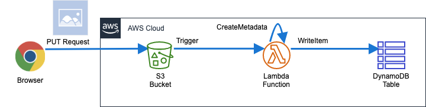

# 画像をアップロードをトリガーにメタデータを保存する非同期アーキテクチャ

この課題ではAmazon S3に画像をアップロードすると､メタデータを取得し､
DynamoDBに保存する非同期アーキテクチャを構築します｡  

## 構成図



## アプリケーションの取得

作業ディレクトリに移動します｡
```bash
cd ~/environment
```
サンプルアプリケーションを取得します｡
```bash
git clone https://github.com/classmethod/serverless-hands-on
```
取得できていることを確認します｡
```bash
cd serverless-hands-on/tasks/task2
ls
```
(例)
```text
Makefile     Pipfile      Pipfile.lock answer       sam          src
```

## SAMテンプレートの作成

未完成のSAMテンプレートを完成させます｡下記のリンクを参考にSAMテンプレートの
TODOとなっている箇所を完成させます｡

- <a href="https://github.com/awslabs/serverless-application-model/blob/master/versions/2016-10-31.md#awsserverlesssimpletable" target="_blank">SAM SimpleTable(DynamoDB) :fa-external-link: </a>
- <a href="https://github.com/awslabs/serverless-application-model/blob/master/versions/2016-10-31.md#s3" target="_blank">SAM Function Events(Lambda) :fa-external-link: </a>

```yaml hl_lines="26 44"
AWSTemplateFormatVersion: "2010-09-09"
Transform: AWS::Serverless-2016-10-31

Parameters:
  LambdaLogGroupNamePrefix:
    Type: String
    Default: /aws/lambda

Globals:
  Function:
    Runtime: python3.7
    Timeout: 30
    MemorySize: 512
    # どちらの値もLambdaでよく使うのでGlobalsに定義
    Environment:
      Variables:
        DATA_TABLE_NAME: !Ref DataTable

Resources:

  # metadataを保存するTable。
  # 同一アカウント、同一リージョン内で一意にしないといけないので、名前は自動生成させる
  DataTable:
    Type: AWS::Serverless::SimpleTable
    Properties:
    # TODO: プライマリキーをString型のidという名前で定義します｡
    # https://github.com/awslabs/serverless-application-model/blob/master/versions/2016-10-31.md#awsserverlesssimpletable

  # 画像を保存するBucket
  # 全世界で一意である必要があるので、名前は自動生成させる
  DataBucket:
    Type: AWS::S3::Bucket

  CreateMetadataFunction:
    Type: AWS::Serverless::Function
    Properties:
      CodeUri: ../src
      Handler: index.handler
      Policies:
        - arn:aws:iam::aws:policy/AmazonS3FullAccess
        - arn:aws:iam::aws:policy/AmazonDynamoDBFullAccess
      Events:
        ObjectCreated:
        # TODO: S3バケットにオブジェクトが作成された時にLambda関数を実行します｡
        # https://github.com/awslabs/serverless-application-model/blob/master/versions/2016-10-31.md#s3

  # Lambdaのログ出力先
  # 明示的に作成する事で､スタック削除時にログが削除される(継続的に課金されない)
  CreateMetadataLogGroup:
    Type: AWS::Logs::LogGroup
    Properties:
      LogGroupName: !Sub ${LambdaLogGroupNamePrefix}/${CreateMetadataFunction}

Outputs:
  LambdaFunction:
    Value: !Ref CreateMetadataFunction
  DataBucketName:
    Value: !Ref DataBucket
  MetadataTableName:
    Value: !Ref DataTable
```

!!! Info
    :fa-clock-o: 演習時間:10分  
    講師は演習時間が過ぎたタイミングで､`answer/template.yaml`を元に､説明を行ってください｡  

完成したら下記のバリデーションコマンドでエラーが無いことを確認してください｡
```bash
sam validate --template sam/template.yaml 
```

## デプロイ

Makefileをデプロイ用タスクランナーとして使用しデプロイを行います｡
作業ディレクトリに移動します｡

```bash
cd ~/environment/serverless-hands-on/tasks/task2
```

Makefile

```makefile
SHELL = /usr/bin/env bash -xeuo pipefail

stack_name:=create-metadata

init:
	@pipenv install --dev

clean:
	@rm -rf src/requirements.txt
	@rm -rf .aws-sam

build: clean
	@pipenv lock --requirements > src/requirements.txt
	@pipenv run sam build --use-container --template sam/template.yaml --base-dir src

package: build
	@pipenv run sam package --s3-bucket $$SAM_ARTIFACT_BUCKET --output-template-file template.yaml

deploy: package
	@pipenv run sam deploy \
		--template-file template.yaml \
		--stack-name $(stack_name) \
		--capabilities CAPABILITY_IAM \
		--no-fail-on-empty-changeset
	@pipenv run aws cloudformation describe-stacks \
		--stack-name $(stack_name) \
		--query Stacks[0].Outputs

destroy:
	@aws s3 rb --force s3://$$(pipenv run aws cloudformation describe-stacks \
    		--stack-name $(stack_name) \
    		--query 'Stacks[].Outputs[?OutputKey==`DataBucketName`].[OutputValue]' --output text) || true
	@pipenv run aws cloudformation delete-stack --stack-name $(stack_name)
	@pipenv run aws cloudformation wait stack-delete-complete --stack-name $(stack_name)

info:
	@echo -n "StackName: "
	@echo $(stack_name)

.PHONY: \
	build \
	package \
	deploy \
	info \
	clean \
	destroy
```

### ビルド

```makefile
build: clean
	@pipenv lock --requirements > src/requirements.txt
	@pipenv run sam build --use-container --template sam/template.yaml --base-dir src
```

`pipenv lock --requirements > src/requirements.txt`で依存ライブラリ情報をテキスト出力します｡  
`sam build --use-container --template sam/template.yaml --base-dir src`でコードのビルド及び依存パッケージのダウンロードと`.aws-sam`に配置を行っています｡後ほどデプロイが終わった後に確認してください｡

### パッケージ

```makefile
package: build
	@pipenv run sam package --s3-bucket $$SAM_ARTIFACT_BUCKET --output-template-file template.yaml
```

`sam package --s3-bucket $$SAM_ARTIFACT_BUCKET --output-template-file template.yaml`でコード及びライブラリの圧縮&アップロードとCloudFormationテンプレートへの変換を行います｡
生成されたテンプレートでは､`CodeUrl:`がアップロードされたバケット名+オブジェクトキー名に変換されています｡後ほどデプロイが終わった後に確認してください｡

### デプロイ

```makefile
deploy: package
	@pipenv run sam deploy \
		--template-file template.yaml \
		--stack-name $(stack_name) \
		--capabilities CAPABILITY_IAM \
		--no-fail-on-empty-changeset
	@pipenv run aws cloudformation describe-stacks \
		--stack-name $(stack_name) \
		--query Stacks[0].Outputs
```

`pipenv run sam deploy --template-file template.yaml --stack-name $(stack_name) --capabilities CAPABILITY_IAM --no-fail-on-empty-changeset`でデプロイを行っています｡

オプションの説明

- `--capabilities CAPABILITY_IAM`
    - 意図しないIAMリソース作成を防ぐための機能
    - 指定する事でIAMリソースの作成を許可する
    - <a href="https://docs.aws.amazon.com/ja_jp/AWSCloudFormation/latest/UserGuide/using-iam-template.html#using-iam-capabilities" target="_blank">AWS Identity and Access Management によるアクセスの制御 - AWS CloudFormation :fa-external-link: </a>
- `--no-fail-on-empty-changeset`
    - <a href="https://dev.classmethod.jp/cloud/aws/introducing-no-fail-on-empty-changeset-option-for-aws-serverless-application-model/" target="_blank">【小ネタ】AWS SAMを継続的デリバリする際に便利なオプションのご紹介 ｜ DevelopersIO :fa-external-link: </a>

 
### デプロイ手順


`deploy→package→build→clean`と依存関係が定義されているので､`deploy`コマンドを実行する事で全ての処理が行なえます｡

```bash
make deploy
```

デプロイが正常に完了したら下記を確認してください｡

- `.aws-sam`配下にコードとライブラリが配置されている事
- `template.yaml`の`CodeUri:`が変換されている事


## 動作の確認

S3バケットにファイルをアップロードし､メタデータが作成される事を確認します｡  

### AWSリソース名の確認

作成されたAWSリソースの名前を取得し変数に格納します｡

```bash
DATA_BUCKET_NAME=$(aws cloudformation describe-stacks --stack-name create-metadata --query 'Stacks[].Outputs[?OutputKey==`DataBucketName`].[OutputValue]' --output text)
METADATA_TABLE_NAME=$(aws cloudformation describe-stacks --stack-name create-metadata --query 'Stacks[].Outputs[?OutputKey==`MetadataTableName`].[OutputValue]' --output text)
LAMBDA_FUNCTION=$(aws cloudformation describe-stacks --stack-name create-metadata --query 'Stacks[].Outputs[?OutputKey==`LambdaFunction`].[OutputValue]' --output text)

echo ${DATA_BUCKET_NAME}
echo ${METADATA_TABLE_NAME}
echo ${LAMBDA_FUNCTION}
```

(例)
```text
create-metadata-databucket-zj5auazx1z3j
create-metadata-DataTable-1UD2D6J9XX9XU
create-metadata-CreateMetadataFunction-16DLW118PT8H1
```

### DynamoDBの事前確認

初期状態のDynamoDBテーブルが空である事を確認します｡

```bash
aws dynamodb scan --table-name ${METADATA_TABLE_NAME}
```

(例)
```json
{
    "Items": [],
    "Count": 0,
    "ScannedCount": 0,
    "ConsumedCapacity": null
}
```

### 画像のアップロード

画像ファイルを用意し､S3バケットにアップロードします｡

```bash
curl -O https://s3-ap-southeast-1.amazonaws.com/kato.ryo-docs/lena.jpg
aws s3 cp ./lena.jpg s3://${DATA_BUCKET_NAME}/
```

### DynamoDBの事前確認

DynamoDBテーブルにメタデータが格納されている事を確認します｡

```bash
aws dynamodb scan --table-name ${METADATA_TABLE_NAME}
```

(例)
```json
{
    "Items": [
        {
            "object_key": {
                "S": "lena.jpg"
            },
            "createdAt": {
                "N": "1569563297808"
            },
            "id": {
                "S": "5fd53590-86a1-468b-b437-82f7dcff9197"
            },
            "bucket_name": {
                "S": "create-metadata-databucket-1egfd65fgvxr9"
            }
        }
    ],
    "Count": 1,
    "ScannedCount": 1,
    "ConsumedCapacity": null
}
```

## GUIでの確認

!!! Info
    講師はAWSマネジメントコンソールで､作成されたリソースの状態を説明してください｡
    1. S3バケットにアップロードされた画像ファイル
        1. イベントの設定
    1. Lambda Functionの動作(CloudWatch Logs)
    1. DynamoDB テーブル

## 削除

作成されたAWSリソースを削除します｡
CloudFormationスタックを削除すると､作成されたAWSリソースも削除されます｡  
```bash
make destroy
```