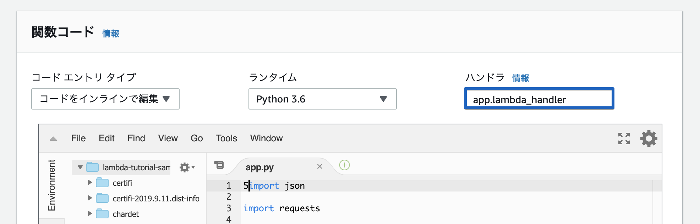
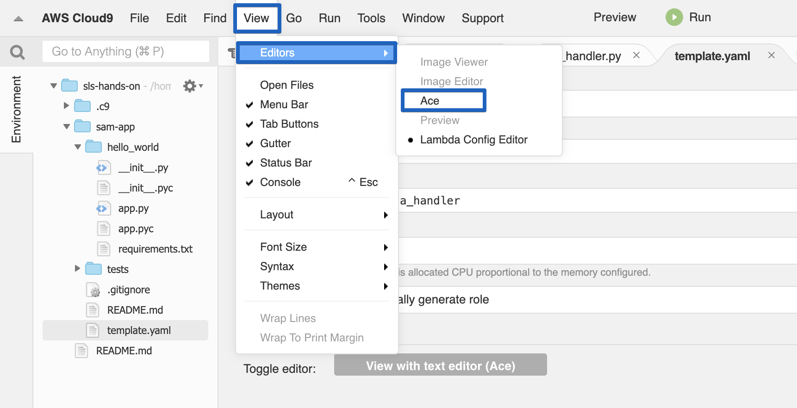

# サンプルアプリケーションのデプロイ

この課題ではサンプルのアプリケーションのコードを確認し､デプロイを行います｡  

## サンプルアプリケーションの取得

作業ディレクトリに移動します｡
```bash
cd ~/environment
```
サンプルアプリケーションを取得します｡
```bash
sam init -r python3.6
```
取得できていることを確認します｡
```bash
ls sam-app
```
(例)
```text
hello_world  README.md  template.yaml  tests
```

## ディレクトリ構成

サンプルアプリケーションの構成は下記の様になっています｡  

```text
sam-app/
├── hello_world                     # アプリケーションディレクトリ
│   ├── app.py                      # Lambda関数
│   ├── app.pyc
│   ├── __init__.py
│   ├── __init__.pyc
│   └── requirements.txt            # ライブラリ定義
├── README.md                       # 説明
├── template.yaml                   # SAMテンプレート(AWSの構成情報)
└── tests                           # テストディレクトリ
    └── unit                        # ユニットテストディレクトリ
        ├── __init__.py
        ├── __init__.pyc
        ├── test_handler.py         # Lambda関数のテストコード
        └── test_handler.pyc
```

## app.py

`app.py`はLambda関数として使用されるコードです｡行いたい処理内容を記載します｡  

```python hl_lines="4 6 13" 
import json
import requests

# Lambdaハンドラー
def lambda_handler(event, context):
    # 実行処理
    try:
        ip = requests.get("http://checkip.amazonaws.com/")
    except requests.RequestException as e:
        print(e)

        raise e
    # レスポンス
    return {
        "statusCode": 200,
        "body": json.dumps(
            {"message": "hello world", "location": ip.text.replace("\n", "")}
        ),
    }
```

### Lambdaハンドラー

Lambda関数は作成する際に､ハンドラーを指定します。これはコードを実行する際に､AWS Lambdaがどの関数を呼び出すかの宣言です。 



引数は下記の通りです｡  

- event: 呼び出し元から受け取るイベントデータです｡このパラメータは通常､Pythonのdict型です｡
呼び出し元により､構成は異なります｡
- context: ランタイム情報です｡(ハンズオンでは取り扱いません｡)

<a href="https://docs.aws.amazon.com/ja_jp/lambda/latest/dg/python-programming-model-handler-types.html" target="_blank">PythonのAWS Lambda関数ハンドラー
 :fa-external-link: </a>

### 実行処理

Lambda内で実行する処理を書きます｡
このアプリケーションでは､`http://checkip.amazonaws.com/`というアクセス元のグローバルIPアドレスをレスポンスするサイトを使って
Lambda関数のグローバルIPアドレスを取得しています｡  
例外(requests.RequestException)が発生した場合は､内容を`print`で出力します｡
Lambda関数の標準出力は<a href="https://docs.aws.amazon.com/ja_jp/AmazonCloudWatch/latest/logs/WhatIsCloudWatchLogs.html" target="_blank">Amazon CloudWatch Logs :fa-external-link: </a>に保存されます｡  

### レスポンス

Lambda関数が後続の処理に返す処理結果を記載します｡どのサービスと連携するかによって戻り値の構成は異なります｡  
このアプリケーションでは､<a href="https://docs.aws.amazon.com/ja_jp/apigateway/latest/developerguide/welcome.html" target="_blank">Amazon API Gateway :fa-external-link: </a>に返すので､HTTPレスポンス形式です｡  

## test_handler.py

`test_handler.py`は`app.py`のテストコード､つまりLambda関数のテストコードです｡  
pytestを利用しています｡  

```python hl_lines="6 14"
import json
import pytest
from collections import namedtuple
from hello_world import app

# テストデータ
@pytest.fixture()
def apigw_event():

    return {
    # 省略: API GatewayがLambda関数に渡すeventのテストデータです
    }

# テスト
def test_lambda_handler(apigw_event, mocker):

    requests_response_mock = namedtuple("response", ["text"])
    requests_response_mock.text = "1.1.1.1\n"

    request_mock = mocker.patch.object(
        app.requests, 'get', side_effect=requests_response_mock)

    ret = app.lambda_handler(apigw_event, "")
    assert ret["statusCode"] == 200

    for key in ("message", "location"):
        assert key in ret["body"]

    data = json.loads(ret["body"])
    assert data["message"] == "hello world"
```

### テストデータ

API GatewayがLambda関数を呼び出す際のeventをテスト様に生成しています｡  

### テスト

Lambda関数のテストコードです｡  
ユニットテストなので､外部へのリクエストを行う箇所は常に`1.1.1.1`を受け取るようにモックしています｡  
以下のテストを行っています｡

- ステータスコードが200(OK)である
- レスポンスボディに`message`, `location`という項目を含む
- レスポンスボディの`data`は`hello world`である

## template.yaml

<a href="https://docs.aws.amazon.com/ja_jp/serverless-application-model/latest/developerguide/what-is-sam.html" target="_blank">SAM(Serverless Application Model) :fa-external-link: </a>
はサーバーレス向けのAWS環境構築の為のフレームワークです｡  
<a href="https://docs.aws.amazon.com/ja_jp/AWSCloudFormation/latest/UserGuide/Welcome.html" target="_blank">AWS CloudFormation :fa-external-link: </a>の拡張で､
サーバーレスアプリケーションを構築する場合はより簡単・少ない記述でインフラストラクチャーを定義する事が可能です｡  
SAMはCloudFormationに変換してからAWSにデプロイします｡(AWS上ではCloudFormationとして扱われます)  

下記のようなSAMの定義ファイルを**SAMのテンプレート**と言います｡  

```yaml hl_lines="6 9 27"
AWSTemplateFormatVersion: '2010-09-09'
Transform: 'AWS::Serverless-2016-10-31'
Description: |
  sam-app
  Sample SAM Template for sam-app
Globals:
  Function:
    Timeout: 3
Resources:
  HelloWorldFunction:
    Type: 'AWS::Serverless::Function'
    Properties:
      CodeUri: hello_world/
      Handler: app.lambda_handler
      Runtime: python3.6
      Environment:
        Variables:
          PARAM1: VALUE
      Events:
        HelloWorld:
          Type: Api
          Properties:
            Path: /hello
            Method: get
      Description: ''
      MemorySize: ''
Outputs:
  HelloWorldApi:
    Description: API Gateway endpoint URL for Prod stage for Hello World function
    Value:
      'Fn::Sub': >-
        https://${ServerlessRestApi}.execute-api.${AWS::Region}.amazonaws.com/Prod/hello/
  HelloWorldFunction:
    Description: Hello World Lambda Function ARN
    Value:
      'Fn::GetAtt':
        - HelloWorldFunction
        - Arn
  HelloWorldFunctionIamRole:
    Description: Implicit IAM Role created for Hello World function
    Value:
      'Fn::GetAtt':
        - HelloWorldFunctionRole
        - Arn
```

!!! Info
    template.yamlを開くとフォームが表示される場合は､**View**､**Editors**､**Ace**と選択してください｡  
    
    
### Globals

このテンプレート内のリソース全体に適用する設定です｡  
Funcitonに対してTimeoutを3(秒)に設定しています｡このテンプレートで定義したLambda関数のタイムアウトは3秒に設定するという意味です｡  
個々のリソースで設定した場合は､その値が優先されます｡  

### Resources

リソースの定義です｡

| 項目名 | 項目の説明 | テンプレートの説明 |
| --- | --- | --- |
| Type | 作成するリソースの種類 | `AWS::Serverless::Function`はLambda関数を作成します |
| CodeUri | Lambda関数のディレクトリ | `hello_world/`にLambda関数のコードは配置されています |
| Handler | Lambda関数のハンドラー | **app**.pyの**lambda_handler**関数を呼び出したいので`app.lambda_handler`と指定します |
| Runtime | Lambda実行環境 | Python3.6で実行を保証するコードなので､`python3.6`と指定します |
| Environment | Lambda環境変数 | 定義されていますが､Lambda関数内では使用していません |
| Events | Lambda呼び出し元の定義 | API Gatewayが`/hello`に`GET`リクエストを受けた時Lambda関数を呼び出す |
| MemorySize | Lambdaのメモリサイズ | MB単位でLambda関数に割り当てるメモリサイズを指定します(省略するとデフォルト値) |

一見すると､作成されるリソースはLambda関数だけと捉えてしまいがちですが､`Events`で定義している為､API Gatewayも作成されます｡  

### Outputs

SAM内の変数や作成したリソースの名称などをエクスポートするのに使用します｡  
例えば､2つのSAMが存在する際に､デプロイ済みの①のOutputsを②でParameterとして使用します｡  
Outputsでエクスポートしておくと､各リソースのマネジメントコンソールを開かずに､CloudFormationのマネジメントコンソールから値の確認ができます｡  
このSAMでは以下がOutputsに登録されています｡

- API Gatewayのエンドポイント名
- Lambda関数のARN(ユニークな識別子)
- Lambda関数のIAMロール(AWSリソースへのアクセス権限)

## テストの実行

用意ずみのテストを実行します｡  

アプリのディレクトリに移動します｡
```bash
~/environment/sam-app
```

必要なライブラリをインストールします｡
```bash
pip install --user requests pytest pytest-mock
```

テストを実行します｡  
```bash
python -m pytest tests/ -v
```

(例)
```text
===================================================================== test session starts =====================================================================
platform linux -- Python 3.6.8, pytest-5.1.2, py-1.8.0, pluggy-0.13.0 -- /usr/bin/python36
cachedir: .pytest_cache
rootdir: /home/ec2-user/environment/sam-app
plugins: mock-1.10.4
collected 1 item                                                                                                                                              

tests/unit/test_handler.py::test_lambda_handler PASSED                                                                                                  [100%]

====================================================================== 1 passed in 0.14s ======================================================================
```

## デプロイ

アプリのディレクトリに移動します｡
```bash
~/environment/sam-app
```

SAMのデプロイには<a href="https://docs.aws.amazon.com/ja_jp/AmazonS3/latest/gsg/GetStartedWithS3.html" target="_blank">S3バケット :fa-external-link: </a>(AWSが提供するオブジェクトストレージ)が必要です｡  
バケット名は全世界でユニークな必要があります｡なので､今回はバケット名に末尾に乱数を追加しています｡意図して名前をつける場合は､AWSアカウントIDを末尾に付ける事も良くあります｡  

バケットの名前を生成します｡
```bash
BUCKET_NAME="sls-hands-on-$(($RANDOM * $RANDOM))"
echo ${BUCKET_NAME}
```

(例) 
```text
sls-hands-on-841850128
```

S3バケットを作成します｡
```bash
aws s3 mb s3://${BUCKET_NAME}
```
(例)
```text
make_bucket: sls-hands-on-841850128
```

SAMをCloudFormationに変換します｡
```bash
sam build
```

(例)
```text
2019-09-19 08:46:39 Found credentials in shared credentials file: ~/.aws/credentials
2019-09-19 08:46:39 Building resource 'HelloWorldFunction'
2019-09-19 08:46:40 Running PythonPipBuilder:ResolveDependencies
2019-09-19 08:46:41 Running PythonPipBuilder:CopySource

Build Succeeded

Built Artifacts  : .aws-sam/build
Built Template   : .aws-sam/build/template.yaml

Commands you can use next
=========================
[*] Invoke Function: sam local invoke
[*] Package: sam package --s3-bucket <yourbucket>
```

Lambda関数のコードをS3バケットにアップロードします｡  
```bash
sam package \
    --output-template packaged.yaml \
    --s3-bucket ${BUCKET_NAME}
```

(例)
```text
Uploading to 617dccc34fdbe3f07c70eeb7984ad0da  527086 / 527086.0  (100.00%)
Successfully packaged artifacts and wrote output template to file packaged.yaml.
Execute the following command to deploy the packaged template
aws cloudformation deploy --template-file /home/ec2-user/environment/sam-app/packaged.yaml --stack-name <YOUR STACK NAME>
```

デプロイします｡  
```bash
sam deploy \
    --stack-name lambda-tutorial-sample-app \
    --template-file ~/environment/sam-app/packaged.yaml \
    --capabilities CAPABILITY_IAM 
```

(例)
```text
Waiting for changeset to be created..
Waiting for stack create/update to complete
Successfully created/updated stack - lambda-tutorial-sample-app
```

!!! Info
    講師は参加者のデプロイが完了したタイミングで､デプロイが完了したCloudFormationスタックについて説明を行ってください｡  
    
    - イベント
    - リソース
    - 出力
    - テンプレート
        - CodeUriが変換されている


## API実行

エンドポイント名を確認します｡`OutputKey:HelloWorldApi`がエンドポイント名です｡

```bash
SAMPLE_APP_ENDPOINT_NAME=$(aws cloudformation describe-stacks --stack-name lambda-tutorial-sample-app --region ap-northeast-1 --query 'Stacks[].Outputs[?OutputKey==`HelloWorldApi`].[OutputValue]' --output text)
echo ${SAMPLE_APP_ENDPOINT_NAME}
```

(例)
```text
https://obgtu7b8m9.execute-api.ap-northeast-1.amazonaws.com/Prod/hello/
```

APIをコールし動作を確認します｡ブラウザで開いても同様に表示される事を確認してください｡
```bash
curl ${SAMPLE_APP_ENDPOINT_NAME}
```

(例)
```text
{"message": "hello world", "location": "13.114.141.65"}% 
```

!!! Info
    講師は参加者のAPI実行が完了したタイミングで､HTTPリクエストが処理される流れについて説明を行ってください｡  
    
    1. API Gateway Endpoint
    1. Lambda Fuction
    1. API Gateway Endpoint

## 削除

作成されたAWSリソースを削除します｡
CloudFormationスタックを削除すると､作成されたAWSリソースも削除されます｡  
```bash
aws cloudformation delete-stack --stack-name lambda-tutorial-sample-app
aws cloudformation wait stack-delete-complete --stack-name lambda-tutorial-sample-app
```